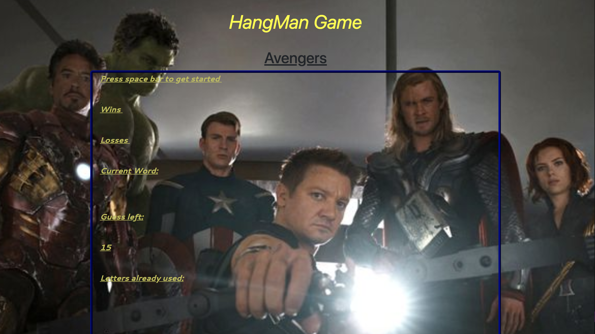

# Word-Guess-Game
Word Guess Game with a Avenger's theme using Javascript

# Link to Deployed Site

[Word-Guess-Game](https://mawais54013.github.io/Word-Guess-Game/)

# Images


# Technology Used 
- HTML
- CSS
- Bootstrap

# Code Snippets
```
var text = ["ironman", "spiderman", "thanos", "thor", "antman", "captainamerica", "hulk", "blackwidow", "starlord"];

    var wins = 0;
    var losses = 0;
    var guessLeft = 16;
    var guess = [];
    var letter=[];


var computerChoice = text[Math.floor(Math.random() * text.length)];
var word = computerChoice.length;

    document.getElementById("text2").innerHTML = "Wins " + "<br>";
    document.getElementById("text21").innerHTML = "Losses " + "<br>";
    document.getElementById("text3").innerHTML = "Current Word:" + "<br>";
    document.getElementById("text5").innerHTML = "Guess left: ";
    document.getElementById("text6").innerHTML = 15;
    document.getElementById("text7").innerHTML = "Letters already used: ";
```
# Learned Materials
I learned to use Javascript as the base for this game while using CSS and Bootstrap to add style and background.

# Author
[Muhammad Awais](https://github.com/mawais54013/Bootstrap-Portfolio)
